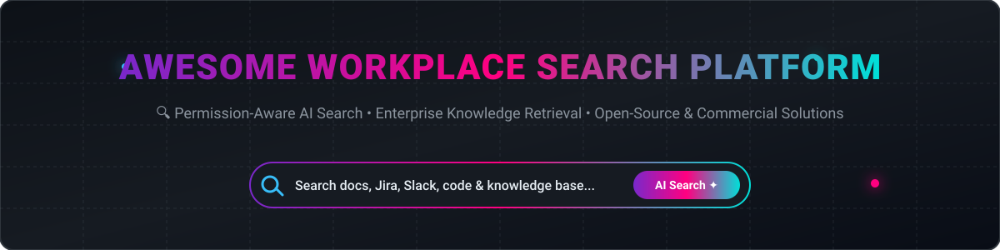

# Awesome Workplace Search Platform 🔍

  
  
  
  
  

## 🚀 Top Workplace Search Platform Tools & Knowledge Retrieval Ecosystem

**Curated List of SaaS/Commercial Products & Open-Source GitHub Projects**  
*Focused on Enterprise/Workplace Search, Unified Knowledge Retrieval, Permission-Aware Search & AI-Powered Company Search*  

**Last updated: August 2026** 📅

---

### 💡 Overview

This repository tracks notable **SaaS platforms** and **open-source projects** for **Workplace Search** and **Enterprise Knowledge Retrieval**. These tools index and search across company applications (docs, chat, tickets, code, email, CRM), respect granular source-system permissions, and offer AI-powered answers and agents grounded in internal company knowledge.

**Category Leaders** include Glean, Elastic Workplace Search, Google Cloud Search, Microsoft Search, IBM Watson Discovery, Algolia, Stack Overflow for Teams, Guru, Slab, and Lucidworks.

**Open-Source Emphasis** 🔓: Self-hosted workplace and enterprise search engines offer full data sovereignty, zero per-seat licensing fees, and the capability to run air-gapped or on-premises.

Contributions are welcome! Please open a Pull Request to add or update entries. 🤝

---

## 📑 Table of Contents

- [🏢 SaaS & Hosted Platforms](#-saas--hosted-platforms)
- [💻 Open-Source GitHub Projects](#-open-source-github-projects)
- [🤝 How to Contribute](#-how-to-contribute)
- [⚠️ Disclaimer](#️-disclaimer)
- [⭐ Star History](#-star-history)

---

## 🏢 SaaS & Hosted Platforms

The table below summarizes commercial workplace search and enterprise AI engines, ordered by **Company Size / Valuation / Market Cap** (descending) 📈.

| Platform / Product | Company Size / Valuation / Market Cap 💰 | Description 📝 | Pricing (Starting Tier) 🏷️ | Free Tier / Free Trial Limit 🎁 |
| :--- | :--- | :--- | :--- | :--- |
| **[Google Cloud Search](https://workspace.google.com/products/cloud-search/)** 🌐 | **~$4.33 Trillion** Market Cap (Alphabet) | Search across Google Workspace and connected third-party enterprise data sources with Google's ranking & security model. | Included in Google Workspace Enterprise or standalone quote; Business tiers start at $6/user/month | 14-day free trial for Google Workspace |
| **[Microsoft Search](https://www.microsoft.com/en-us/microsoft-search)** 🪟 | **~$3.80 Trillion** Market Cap (Microsoft) | Unified search experience across Microsoft 365, SharePoint, Teams, OneDrive, and partner content connectors. | Included in Microsoft 365 E3 at ~$36/user/month (annual commitment) | 1-month free trial for Microsoft 365 enterprise plans |
| **[IBM Watson Discovery](https://www.ibm.com/products/watson-discovery)** 🤖 | **~$220 Billion** Market Cap (IBM) | Enterprise AI-powered search and text analytics platform utilizing advanced NLP over complex business documents. | Plus plan starts at $500/month (includes 10,000 docs and 10,000 queries/month) | 30-day free trial on the Plus plan |
| **[Elastic Workplace Search / Search AI](https://www.elastic.co/)** ⚡ | **~$7.5 Billion** Market Cap (Elastic NV) | Enterprise search capabilities built on Elasticsearch with pre-built connectors & AI relevance tuning. | Standard tier starts at $99/month (Cloud resource-based pricing) | 14-day free trial (1 hosted deployment & 3 serverless projects) |
| **[Glean](https://www.glean.com/)** ✨ | **$7.2 Billion** Valuation ($300M+ ARR) | Leading AI-powered workplace search connecting SaaS apps with permission-aware search & generative answers. | Custom Enterprise pricing (est. $50–$75/user/month, 100-seat min contract) | No free tier; paid Proof of Concept (POC) evaluation only |
| **[Algolia](https://www.algolia.com/)** ⚡ | **$2.25 Billion** Valuation | Flexible search and discovery API platform adaptable for workplace search, internal docs, and SaaS apps. | Usage-based Grow plan starts at $0.50 per 1,000 search requests after free tier | Free "Build" plan forever: 10,000 search requests & 100,000 records/month |
| **[Stack Overflow for Teams](https://stackoverflow.co/teams/)** 📚 | **$1.8 Billion** Valuation (Acquired by Prosus) | Structured developer Q&A and knowledge sharing platform with permission-aware internal search. | Basic plan starts at $6/user/month (billed annually) | Free forever for up to 50 users |
| **[Lucidworks](https://lucidworks.com/)** 🔍 | **~$100 Million+** Valuation (~$30M+ ARR) | Enterprise search and AI platform (Fusion Cloud / Self-Managed) for complex internal knowledge and e-commerce search. | Custom Enterprise pricing (Cloud managed options start at ~$3,000/month) | No public free tier or self-service trial; sales-led sandbox evaluation only |
| **[Guru](https://www.getguru.com/)** 🧠 | **~$70 Million** Total Raised (~$63M ARR) | Knowledge management platform with strong internal search, verification, and AI assistant capabilities. | Self-Serve plan starts at $15/user/month (10-seat min, $150/month) | 30-day free trial (no permanent free tier for teams) |
| **[Slab](https://slab.com/)** 📑 | **~$2.2 Million** Total Raised (~$3M ARR) | Modern team wiki and knowledge base platform with unified search and real-time collaborative editing. | Startup plan starts at $8/user/month (billed annually) | Free forever for up to 10 users (10MB file attachment limit) |

---

## 💻 Open-Source GitHub Projects

Below is a curated list of open-source self-hosted workplace search engines, vector search stacks, and RAG platforms, ordered by **GitHub Star Count** (descending) ⭐.

1. **[Open WebUI](https://github.com/open-webui/open-webui)**  🌟  
   Extensible, self-hosted AI interface with RAG support, document retrieval, and enterprise knowledge indexing capabilities over company files.

2. **[RAGFlow](https://github.com/infiniflow/ragflow)**  🌊  
   Open-source RAG (Retrieval-Augmented Generation) engine based on deep document understanding, offering fine-grained workplace search and grounding.

3. **[AnythingLLM](https://github.com/Mintplex-Labs/anything-llm)**  🧠  
   All-in-one desktop and enterprise self-hosted application for RAG, document search, custom agents, and internal knowledge access control.

4. **[LibreChat](https://github.com/danny-avila/LibreChat)**  💬  
   Enhanced open-source AI platform supporting multi-model search, custom RAG pipelines, agentic retrieval, and multi-user workplace knowledge search.

5. **[Khoj](https://github.com/khoj-ai/khoj)**  🔎  
   Self-hostable AI second brain and enterprise search engine that indexes personal & company docs (PDFs, Notion, GitHub, Markdown) with offline LLM support.

6. **[Onyx (formerly Danswer)](https://github.com/onyx-dot-app/onyx)**  💎  
   Premier open-source Glean alternative. Self-hostable AI enterprise search with 40+ pre-built connectors, permission-aware retrieval, AI chat with citations, agents, and deep research. MIT licensed.

7. **[OpenSearch](https://github.com/opensearch-project/OpenSearch)**  🔍  
   Community-driven, open-source search and analytics suite derived from Elasticsearch, widely deployed as the core search backbone for enterprise data pipelines.

8. **[Vespa](https://github.com/vespa-engine/vespa)**  ⚡  
   Low-latency, high-throughput open-source big data serving engine tailored for vector search, lexical search, and real-time AI retrieval at enterprise scale.

9. **[Omni](https://github.com/getomnico/omni)**  🌐  
   Open-source workplace search and chat built on Postgres (ParadeDB + pgvector). Combines hybrid BM25 + vector retrieval with workplace app connectors.

10. **[Xyne](https://github.com/xynehq/xyne)**  🚀  
    AI-first open-source search & answer engine for work. Connects to internal tools, indexes data with relationship graphs, and provides permission-aware workplace answers.

11. **[OpenBeam](https://github.com/kuluruvineeth/openbeam)**  📡  
    Open-source enterprise AI search platform focused on hybrid search, modular connectors, agents, and self-hosting for complete data sovereignty.

---

### 🛠️ Frameworks & Underlying Search Engines

- **[Meilisearch](https://github.com/meilisearch/meilisearch)** & **[Typesense](https://github.com/typesense/typesense)**: Lightning-fast open-source search engines ideal for lightweight internal documentation and portal search.
- **[LangChain](https://github.com/langchain-ai/langchain)** & **[LlamaIndex](https://github.com/run-llama/llama_index)**: Popular Python/TS frameworks for building permission-aware RAG pipelines and custom workplace search agents.

---

## 🤝 How to Contribute

1. Fork the repository 🍴
2. Create a feature branch (`git checkout -b add-new-tool`)
3. Add/edit entries in `README.md` in sorted order 📝
4. Include: name, link, star count badge/valuation details, and concise summary
5. Submit a Pull Request with a clear description 🚀

---

## ⚠️ Disclaimer

- This is a **community-curated** list for informational and educational purposes.
- Enterprise search involves sensitive corporate data and access policies. Always verify that self-hosted or SaaS search solutions respect source-system permissions and meet your organization's security standards.

---

## ⭐ Star History

<a href="https://www.star-history.com/?repos=ishandutta2007%2FAwesome-Workplace-Search-Platform&type=date&legend=bottom-right">
<picture>
<source media="(prefers-color-scheme: dark)" srcset="https://api.star-history.com/chart?repos=ishandutta2007/Awesome-Workplace-Search-Platform&type=date&theme=dark&legend=bottom-right" />
<source media="(prefers-color-scheme: light)" srcset="https://api.star-history.com/chart?repos=ishandutta2007/Awesome-Workplace-Search-Platform&type=date&legend=bottom-right" />

</picture>
</a>

---

**Made for knowledge workers, platform engineers, and organizations seeking sovereign internal search.** 🛠️  
Let's make company knowledge more findable and under your control! ✨
 
